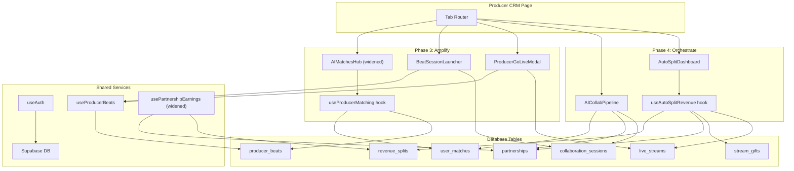
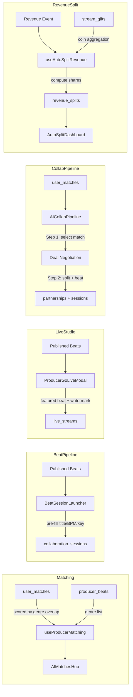
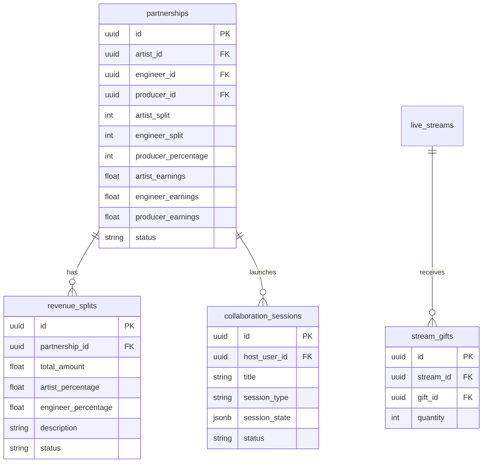
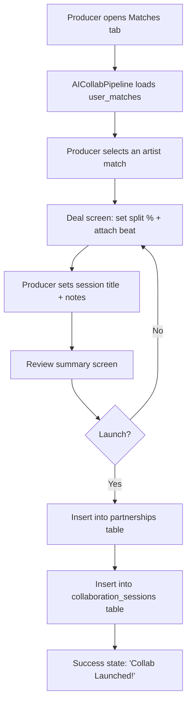
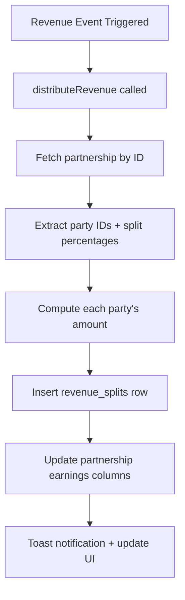
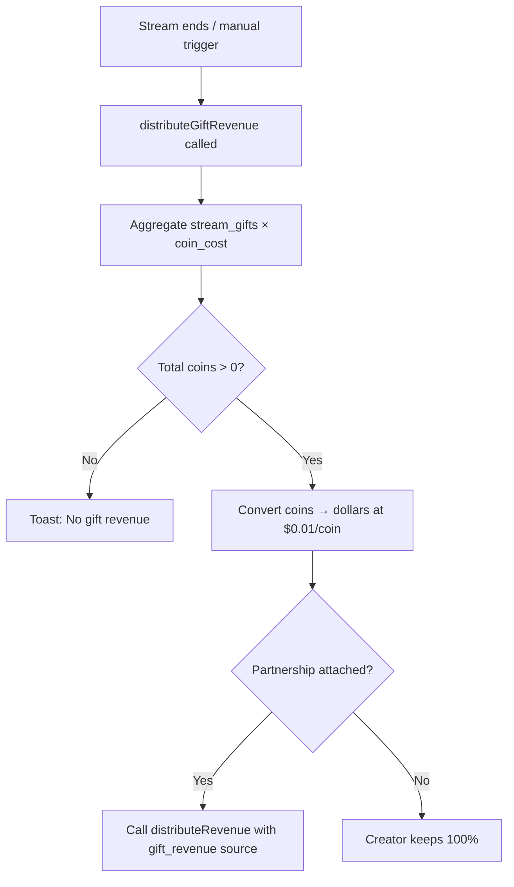

# Design Document — Producer CRM Expansion (Phases 3–4)

## Overview

Extend the MixxClub Producer CRM with AI-powered features and revenue automation. Phase 3 ("Amplify") integrates AI matching for producers, a beat-to-session pipeline, and producer-branded live studio. Phase 4 ("Orchestrate") delivers an end-to-end AI collaboration pipeline and automatic multi-party revenue splitting with gift-revenue conversion.

**Scope:** 6 new components, 2 new hooks, 3 modified files.

---

## Architecture Design

### System Architecture Diagram



### Data Flow Diagram



---

## Component Design

### AIMatchesHub (widened)

- **Responsibilities:** Display AI match recommendations for all 3 user types
- **Interfaces:** `userType: 'artist' | 'engineer' | 'producer'`
- **Dependencies:** `useAIMatching`, `useProducerMatching` (producer-specific scoring)

### useProducerMatching

- **Responsibilities:** Score artists based on genre overlap with producer's beat catalog
- **Interfaces:** `useProducerMatching(userId?: string) → { data, isLoading, error }`
- **Dependencies:** `user_matches` table, `producer_beats` table via Supabase

### BeatSessionLauncher

- **Responsibilities:** Launch collab sessions directly from beats with pre-filled metadata
- **Interfaces:** Self-contained (uses `useProducerBeats`, `useAuth`)
- **Dependencies:** `producer_beats`, `collaboration_sessions` tables

### ProducerGoLiveModal

- **Responsibilities:** Producer-branded go-live flow with beat selector, watermark, purchase CTA
- **Interfaces:** `open: boolean`, `onOpenChange: (open: boolean) => void`
- **Dependencies:** `useLiveStreamManager`, `useProducerBeats`

### AICollabPipeline

- **Responsibilities:** End-to-end collab orchestration: match → deal → launch
- **Interfaces:** `userType: 'artist' | 'engineer' | 'producer'`
- **Dependencies:** `user_matches`, `partnerships`, `collaboration_sessions`, `useProducerBeats`

### useAutoSplitRevenue

- **Responsibilities:** Automatic multi-party (2/3-way) revenue distribution + gift conversion
- **Interfaces:**
  - `distributeRevenue(partnershipId, totalAmount, source?, description?)` → `DistributionRecord`
  - `distributeGiftRevenue(streamId)` → `GiftRevenueBreakdown`
  - `fetchDistributionHistory()` → sets `distributions` state
- **Dependencies:** `partnerships`, `revenue_splits`, `stream_gifts`, `live_gifts`, `live_streams`

### AutoSplitDashboard

- **Responsibilities:** Visualize auto-split distributions with summary stats and feed
- **Interfaces:** `userType: 'artist' | 'engineer' | 'producer'`
- **Dependencies:** `useAutoSplitRevenue`

---

## Data Model

### Core Data Structures

```typescript
// useProducerMatching return type
interface ProducerMatch {
  matchId: string;
  artistId: string;
  artistName: string;
  avatarUrl?: string;
  matchScore: number;       // 0–100
  genreOverlap: string[];   // shared genres
  matchReason?: string;
}

// useAutoSplitRevenue types
interface SplitParty {
  userId: string;
  role: 'artist' | 'engineer' | 'producer';
  percentage: number;
  amount: number;           // computed: totalAmount × percentage / 100
}

interface DistributionRecord {
  id: string;
  partnershipId: string;
  totalAmount: number;
  parties: SplitParty[];
  source: 'manual' | 'beat_sale' | 'session' | 'gift_revenue' | 'stream';
  status: 'completed' | 'pending' | 'failed';
  createdAt: string;
}

interface GiftRevenueBreakdown {
  streamId: string;
  totalCoins: number;
  coinRate: number;         // $0.01 per coin
  totalRevenue: number;
  parties: SplitParty[];
}

// BeatSessionLauncher session_state JSON
interface BeatSessionState {
  beat_id: string;
  beat_title: string;
  beat_bpm?: number;
  beat_key?: string;
  beat_genre?: string;
}
```

### Data Model Diagram



---

## Business Process

### Process 1: AI Collaboration Pipeline (Match → Deal → Launch)



### Process 2: Auto-Split Revenue Distribution



### Process 3: Gift Revenue Conversion



---

## Error Handling Strategy

| Component | Error Scenario | Handling |
|-----------|---------------|----------|
| `AICollabPipeline` | Match fetch fails | `console.error` + empty state UI |
| `AICollabPipeline` | Partnership/session creation fails | `toast.error` + stay on launch step |
| `BeatSessionLauncher` | Session creation fails | `toast.error` + reset dialog state |
| `ProducerGoLiveModal` | Stream start fails | `toast.error` (inherited from GoLiveModal pattern) |
| `useAutoSplitRevenue` | Partnership not found | Throws → caught → destructive toast |
| `useAutoSplitRevenue` | Revenue split insert fails | Throws → caught → destructive toast |
| `useAutoSplitRevenue` | Gift aggregation fails | Throws → caught → destructive toast |
| `usePartnershipEarnings` | Query fails | `console.error` + sets `error` state |

All DB operations use try/catch with user-facing toasts for failures and console.error for debugging.

---

## Testing Strategy

### Automated Tests

- **TypeScript compilation:** `npx tsc --noEmit` — verified exit 0 across all phases
- **Import resolution:** All new files resolve correctly via `@/` path aliases

### Manual Verification

- Producer CRM → **Matches tab**: AICollabPipeline stepper renders above MatchesHub
- Producer CRM → **Catalog tab**: BeatSessionLauncher renders below ProducerCatalogHub
- Producer CRM → **Earnings tab**: AutoSplitDashboard renders above CollaborativeEarnings
- Producer CRM → **Go Live button**: ProducerGoLiveModal shows Beat Making type + beat selector
- Pipeline flow: select match → set split → attach beat → launch → verify partnership + session rows created

### Integration Verification

- `usePartnershipEarnings` query includes `producer_id` — producers see their partnerships
- `useAutoSplitRevenue.distributeRevenue` correctly reads 3-way splits from partnership row
- `useAutoSplitRevenue.distributeGiftRevenue` aggregates coins and converts at $0.01/coin rate
