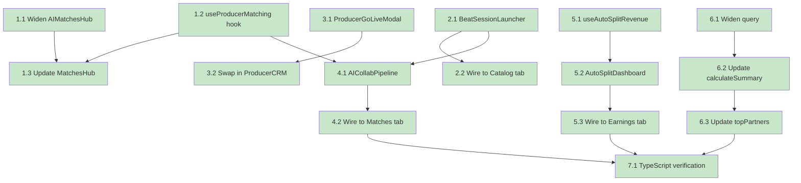

# Implementation Plan

## Phase 3: Amplify

- [x] 1. Widen AI Matching for Producer Role
- [x] 1.1 Update `AIMatchesHub` to accept `userType: 'producer'`
  - Widen the `AIMatchesHubProps` interface union type
  - Pass `userType` through to matching logic
  - _Requirements: 1.1_
- [x] 1.2 Create `useProducerMatching` hook
  - Fetch producer's published beats via `useProducerBeats`
  - Score artists by genre overlap against beat catalog genres
  - Return scored matches sorted by `match_score` descending
  - _Requirements: 1.2, 1.3, 1.4_
- [x] 1.3 Update `MatchesHub` subtitle and search placeholder for producer
  - Add third conditional branch for `userType === 'producer'`
  - Set subtitle to "Find artists matched to your beats"
  - Set search placeholder to "Search artists..."
  - _Requirements: 2.1, 2.2_

- [x] 2. Beat-to-Session Pipeline
- [x] 2.1 Create `BeatSessionLauncher` component
  - Render beat selector from `useProducerBeats.publishedBeats`
  - Pre-fill session title with beat title on selection
  - Store BPM, key, genre in `session_state` JSON
  - Insert into `collaboration_sessions` with `session_type: 'recording'`
  - Display toast on success or error
  - _Requirements: 3.1, 3.2, 3.3, 3.4, 3.5_
- [x] 2.2 Wire `BeatSessionLauncher` into ProducerCRM Catalog tab
  - Import and render below `ProducerCatalogHub`
  - _Requirements: 3.1_

- [x] 3. Producer Go-Live Modal
- [x] 3.1 Create `ProducerGoLiveModal` component
  - Extend `GoLiveModal` pattern with "Beat Making" stream type
  - Add beat selector, watermark toggle, purchase CTA toggle
  - Apply amber-themed UI
  - _Requirements: 4.1, 4.2, 4.3, 4.4, 4.5, 4.6_
- [x] 3.2 Replace `GoLiveModal` with `ProducerGoLiveModal` in ProducerCRM
  - Swap import and usage
  - _Requirements: 4.1_

## Phase 4: Orchestrate

- [x] 4. AI Collaboration Pipeline
- [x] 4.1 Create `AICollabPipeline` component
  - Step 1: Fetch top 6 matches from `user_matches`, render selectable list
  - Step 2: Split slider (10–90%), optional beat attachment, session title input, notes textarea
  - Step 3: Review summary + Launch button
  - On launch: insert `partnerships` row + `collaboration_sessions` row
  - Success state with "Start Another" reset
  - Error handling: toast on failure, remain on current step
  - _Requirements: 5.1, 5.2, 5.3, 5.4, 5.5, 5.6, 5.7, 5.8, 5.9_
- [x] 4.2 Wire `AICollabPipeline` into ProducerCRM Matches tab
  - Render above `MatchesHub`
  - _Requirements: 5.1_

- [x] 5. Auto-Split Revenue Engine
- [x] 5.1 Create `useAutoSplitRevenue` hook
  - `distributeRevenue`: read partnership splits, compute party amounts, insert `revenue_splits`, update earnings columns
  - `distributeGiftRevenue`: aggregate `stream_gifts` × `coin_cost`, convert at $0.01/coin, route through `distributeRevenue`
  - `fetchDistributionHistory`: fetch recent distributions joined with partnership data
  - _Requirements: 6.1, 6.2, 6.3, 6.4, 6.5, 6.6, 7.1, 7.2, 7.3, 7.4, 7.5_
- [x] 5.2 Create `AutoSplitDashboard` component
  - 3 summary cards: Total Distributed, Your Share, Gift Revenue
  - Scrollable feed with color-coded split bars (indigo/emerald/amber)
  - Source badges, status icons, time-ago stamps
  - Empty state fallback
  - Refresh button
  - _Requirements: 8.1, 8.2, 8.3, 8.4, 8.5_
- [x] 5.3 Wire `AutoSplitDashboard` into ProducerCRM Earnings tab
  - Render above `CollaborativeEarnings`
  - _Requirements: 8.1_

- [x] 6. Partnership Earnings Producer Support
- [x] 6.1 Widen `usePartnershipEarnings` query for producer
  - Add `producer_id.eq.{userId}` to OR clause
  - _Requirements: 9.1_
- [x] 6.2 Update `calculateSummary` for producer earnings
  - Add `producer_earnings` branch in totalEarnings reducer
  - _Requirements: 9.2_
- [x] 6.3 Update `topPartners` for 3-way role detection
  - Detect artist/engineer/producer and show correct partner label
  - _Requirements: 9.3_

- [x] 7. Verification
- [x] 7.1 Run `npx tsc --noEmit` — verify zero errors
  - _Requirements: NFR-1_

## Tasks Dependency Diagram

